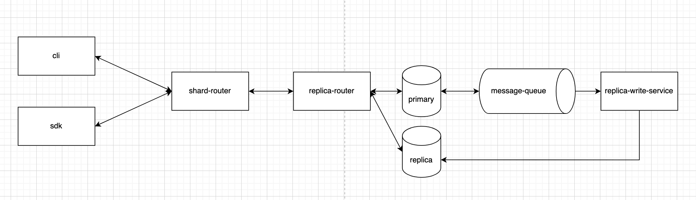

## Distributed Key-Value Database

This database will support horizontal scaling via sharding, replication, and
2-layer routing. Nodes will follow a CQRS architecture with eventual consistency
supported via Kafka. Nodes will communicate via gRPC and are thread-safe, and
the database can be interfaced via a CLI or SDKs.

### Architecture


### Tech Stack
- C++
- gRPC
- Kubernetes
- Kafka
- googletest
- Docker
- CMake
- Protobuf

### Quick Start

Prerequisites:
- Docker
- Minikube
- Kubectl

Start minikube and point your terminal's Docker CLI to minikube's engine:
```bash
minikube start
eval $(minikube docker-env)
```

Build the base image and the images of each service:
```bash
docker build -f Dockerfile.base . -t michaelyi/base:latest
docker build -f db/Dockerfile . -t michaelyi/db:latest
docker build -f router/Dockerfile . -t michaelyi/router:latest
```

Port forward to the router:
```bash
kubectl port-forward services/router 50051:80
```

Send gRPC requests to the database at `grpc://localhost:50051` using `protobufs/db.proto`.

### TODO
- [ ] Subrouters: Leader Election, Sharding vs. Replication 
- [ ] Eventual Consistency
- [ ] Horizontal Scaling Support for Router
- [ ] Input Validation
- [ ] Logging
- [ ] Unit Testing
- [ ] Hash Ring Algorithm
- [ ] Check Channel Connectivity Before Registering Shard
- [ ] Register Node -> Register Shard
- [ ] SSL Termination
- [ ] Namespaces
- [ ] CLI
- [ ] SDKs
